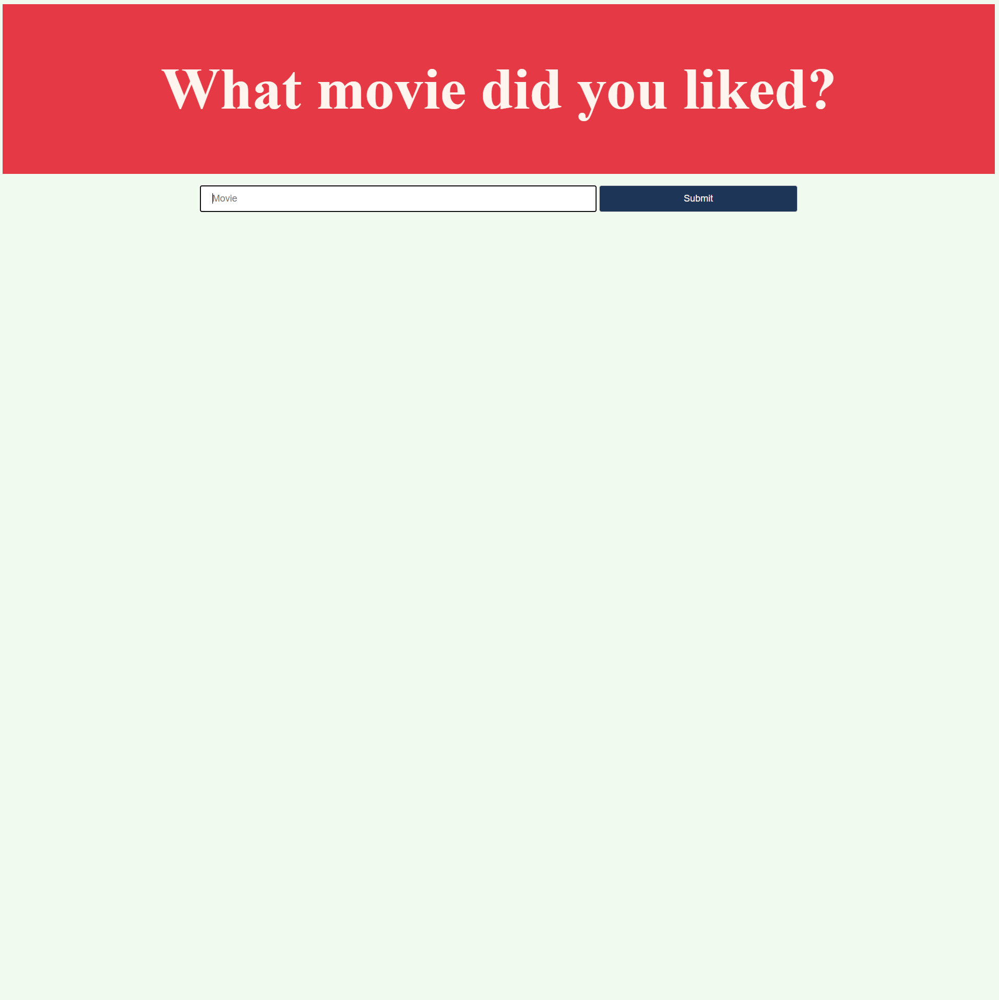
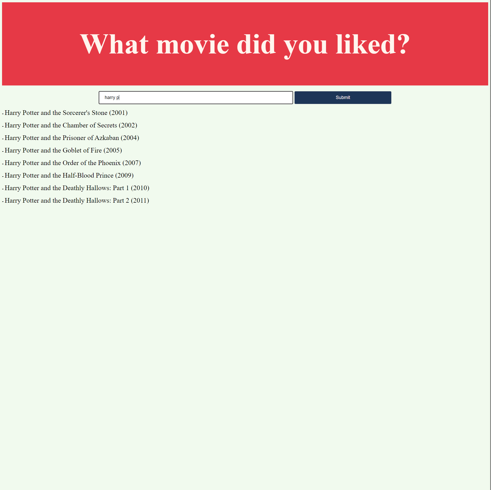
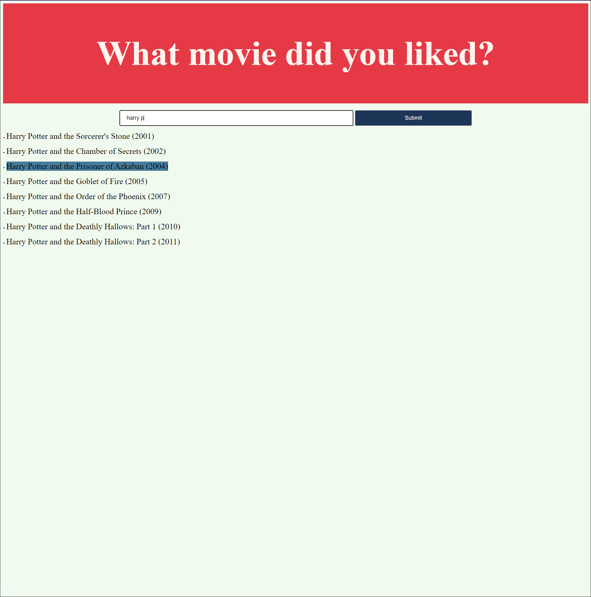
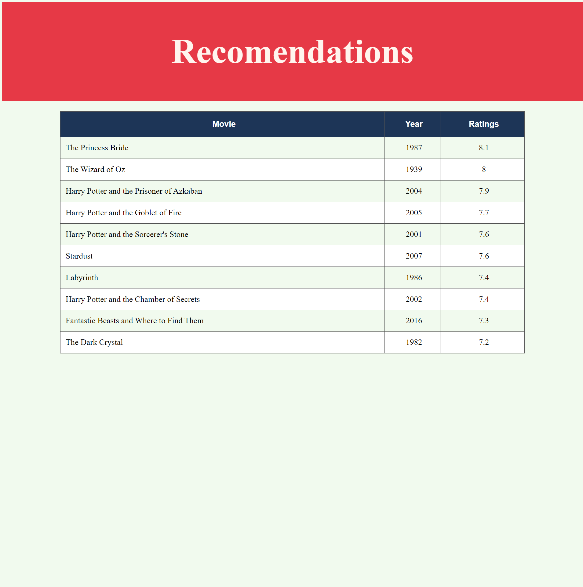

# Movie Recommendation Tool
#### Video Demo:  https://www.youtube.com/watch?v=yqukyNsKzvk
#### Description: One app that you input one movie and it recomends movies of same genre with high ratings and votes. It was develop with Flask and uses an SQLite database to query and store the data. you can check the requirements and how to set-up in the following explanation.

## Getting Started

These are the instructions of how to get-start with this app. it will give you most of the files required plus the instructions on how to run the project on yout local machine.

Note the the project was not deployed and not properly test in  a live system.

### Prerequisites

The app was made with the intention of being a simple platform where you select a movie and get good related recomendations.

It was develop with Flask and use the following requirements in the virtual environment:

|Package|Version|
|Python|3.9.6|
|click|8.0.1|
|colorama|0.4.4||
|Flask|2.0.1|
|flask-marshmallow|0.14.0|
|Flask-SQLAlchemy|2.5.1|
|greenlet|1.1.1|
|itsdangerous|2.0.1|
|Jinja2|3.0.1|
|MarkupSafe|2.0.1|
|marshmallow|3.13.0|
|marshmallow-sqlalchemy|0.26.1|
|pip|21.2.4|
|setuptools|56.0.0|
|six|1.16.0|
|SQLAlchemy|1.4.23|
|Werkzeug|2.0.1|

### Installing

After having all the important libraries for the project, you can run the flask application interface by running seting up the variables:

    FLASK_APP = 'application.py'
    FLASK_ENG = 'development'

After this set-up you can CD into the directory of the project and use the command "flask run" as result it shows a local ip where you can see the application running and interact with it in a useful manner.

It is required to set up a movie.db. In order to do it, you can download the files title.basic.tsv and title.ratings.tsv from https://datasets.imdbws.com/ 

From there just follow the SQL log into the sqlite3 and you will have an working datavase for the application. It is **not dynamic, the set-up is important**

## Running the tests

The tests for this application was made manualy by clicking different options and measuremts of the result. 

### Sample Tests

There fore a simple test that you can do is type:

"harry p"

check if a list of the harry potter movies appear and than click one to see a table recomendation. If a table does not appear, might need to set up the database as the SQL log describe it.

## Files

The application have the following files:

movies.db - Where the data of movies is store

application.py - Where the view, controller and routes are defined 

SQL LOG - steps to setup the files for your own database.

Templates - colection of html and js files used into the route

static - the style.css of the app

## How to use it 

1 - Set up your personal database following the SQL log

2 - Add the libraries and the flask WSGI webserver

3 - Start to type any movie

4 - Finish typing or click the title in the display below

5 - look at the recomendation and enjoy!

## Built With

  - Flask, SQLite, python, HTML, CSS, Javascript 

## Authors

  - **Victor Honorato Pinheiro**

---

## Screenshots

